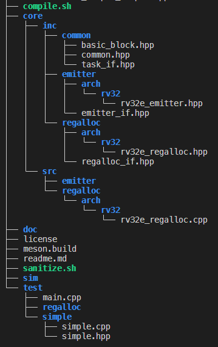

# 1. Introduction
RVEmitter is a playground space for a primitive instruction emitter targetting Risc5 ISA. 

<br>

# 2. Dependencies
The following dependencies must be installed on the build instance depending on the build configuration.

<br>

## 2.1 Base framework only (lite build)
- meson
- fmt
- clang
- clang-tools

<br>

## 2.2 Verilated model
On top of the lite build requirements include:

- verilator
- any riscv softcore rtl

<br>

## 2.3 Qemu build

Wip

<br>

## 2.3 Spike Sim build

Wip

<br>

## 3. Compile
To compile the code simply issue the following commands: 
- `chmod +x compile.sh` (required first time)
- `./compile.sh`

You may also run `sanitize.sh` if you'd like to use clang-address-sanitizer.

<br>

# 4. Intended use
To generate code 3 components are required: 
- A basic block that holds the generated instructions and data.
- A register allocator to allocate registers on demand (or fallback to stack if there are no available registers).
- An emitter that emits instructions within basic block's memory space.

The example below performing a simple addition demonstrates the intended use of the framework by a JIT/AOT compiler:

```C++
const int32_t SimpleTest::Run(const int argc, const char** argv) {
    fmt::print("Simple test start..\n");

    // Create a basic block to emit instructions & Define label and offset.
    constexpr const std::string_view bb_label = "main";
    constexpr const size_t bb_offset = 0;
    std::unique_ptr< BasicBlock >  bb { std::make_unique<BasicBlock>(bb_label, bb_offset) };

    // Create a register allocator
    std::unique_ptr< RegisterAllocatorInterface > ralloc { std::make_unique<RV32E_SimpleRegisterAllocator>() };

    // Create an emitter and pass in the block & reg allocator
    std::unique_ptr< EmitterInterface > emitter { std::make_unique<RV32E_Emitter>( bb.get(), ralloc.get()) };

    // Get 2 available registers to work
    const auto lhs = ralloc->GetNextGPR(rcls_temp);
    const auto rhs = ralloc->GetNextGPR(rcls_temp);
    assert ((lhs != k_invalid_reg_index) && (rhs != k_invalid_reg_index) );

    // Move data
    emitter->LoadImmediate(lhs, 64);
    emitter->LoadImmediate(rhs, 32);

    // Perform lhs(rd) = lhs(rs1) + rhs(rs2) 
    emitter->AddRmRn(lhs, lhs, rhs);

    // Free registers
    ralloc->FreeGPR(lhs);
    ralloc->FreeGPR(rhs);

    // Code is now stored in bb->GetCode()
    fmt::print("Simple test end..\n");

    // Done
    return 0;
}
```

<br>

# 4. Running tests
Currently all tests run from within the main entry point of the application. No dedicated TestBench or automated testing flow is set.

<br>

# 5. Supported ISAS & Instructions

<br>

# 6. Project structure
wip

